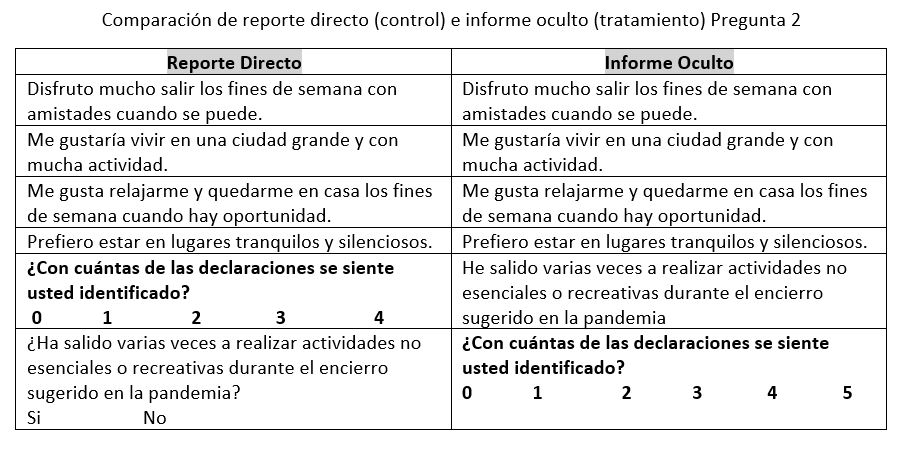

```{r setup, include=FALSE}
knitr::opts_chunk$set(echo = TRUE)
pacman::p_load(foreign, fixest, tidyverse,
               stargazer, kableExtra,
               MASS, memisc, sandwich,
               haven, oaxaca, devtools)
# existen secciones de codigo que se ejecutan en Stata directamente desde R
# Para poder ejecutar el Rmd correr el siguiente par de lineas comentadas

# install_github('hemken/Statamarkdown') correr si se quiere ver el output de stata

# library(Statamarkdown) correr si se quiere ver el output de stata

# finalmente, los chunks que indican Stata al inicio no se ejecutan por default
# para que corra mas rapido, si se quieren ejecutar y ver el output basta cambiar
# las opciones de dichos chunks a include=T y eval=T y modificar el directorio
# de cualquier manera se anexa en Canvas un do-file de Stata con los comandos que se
# incluyen en los chunks

base <- as.data.frame(read.dta("bd_clean.dta"))
```

<style>
body {
text-align: justify}
</style>

# Introducción

La pandemia de COVID-19 cambió en poco tiempo la dinámica y el ritmo de la cotidianeidad que México conocía. Desde la declaración de emergencia sanitaria por el coronavirus en marzo de 2020, las políticas de confinamiento contempladas en la *Jornada Nacional de Sana Distancia* y en el *Semáforo de Riesgo Epidémico* incluyeron la suspensión  temporal de ciertas actividades económicas y la reprogramación de eventos masivos. Consecuentemente, para gran parte de la población esto significó una disrupción en el ámbito laboral y en las opciones disponibles de actividades recreativas. 

Una de las actividades más afectadas por la pandemia fue el fútbol, el deporte favorito de los mexicanos. De acuerdo con Mike Arriola, presidente de la Liga MX, el fútbol mexicano perdió más de 4 mil millones de pesos como consecuencia de la suspensión de actividades y las restricciones sobre el público permitido. En 2020 se jugaron partidos a puerta cerrada y durante el primer semestre de 2021 se permitió entre un 20 y 50 por ciento de aforo en los estadios. No fue sino hasta finales de este año que los estadios de algunas ciudades recuperaron la totalidad de los rubros de ingreso y que todos los equipos reabrieron sus puertas.     

Sin embargo, este golpe sobre la industria del deporte y las actividades dentro de los estadios no ha sido exclusivo de México. En Estados Unidos, el país con el mayor número de casos de COVID-19, se cancelaron o pospusieron la mayoría de los grandes eventos deportivos. Adicionalmente, incluso en eventos sin restricciones de aforo, persisten las dificultades de regresar a los altos niveles de asistencia característicos de los tiempos pre-pandémicos. 

Dada la evolución de la pandemia y sus consecuencias, la cercanía de México con Estados Unidos y la amenaza de una nueva cepa que podría regresar a México a un confinamiento estricto, resulta natural preguntarse cuál es la opinión de los mexicanos respecto a que se permita el aforo del 100% en los estadios de Estados Unidos. Nosotros elaboramos una encuesta con el afán de responder esta pregunta y de analizar las variables que influyen en que dicha opinión sea favorable o desfavorable. 

# Encuesta e Hipótesis 

La encuesta se condujo por Internet entre nuestros amigos y familiares, por lo que no pretende ser representativa de la población mexicana. En ella, incluimos preguntas sobre distintas características que pensamos podrían influir en la opinión de las personas. En particular, incluimos preguntas sobre **variables demográficas** como género, edad y educación. 

Nuestras hipótesis son que, en promedio, los hombres estarán más de acuerdo con que se permita que se llenen los estadios en Estados Unidos. Además, que conforme la edad del encuestado sea mayor, se tendrá mayor aversión al riesgo de contagiarse de COVID y por lo tanto, estará menos de acuerdo con la apertura de los estadios. En cuanto a la educación de los individuos, nuestra hipótesis es que entre menor educación tenga la persona, menos informada estará de los riesgos por contagio de COVID-19, y consecuentemente estará más de acuerdo con que se llenen los estadios.

La encuesta también incluyó variables relacionadas con las **percepciones que tienen los individuos sobre los riesgos por COVID**. Por mencionar algunos ejemplos, en la encuesta les preguntamos a los individuos sobre su percepción respecto a la probabilidad de contraer COVID en los próximos 3 meses, ya que pensamos que los individuos que consideran que tienen una mayor probabilidad de contagiarse estarían, en promedio, en desacuerdo con que se llenen los estadios. Adicionalmente, consideramos que es más probable que los individuos que han seguido en mayor medida las recomendaciones de las autoridades sanitarias durante la pandemia estén en desacuerdo con que se llenen los estadios, por lo que también incluimos un set de preguntas relacionadas con este tema. 

Asimismo, consideramos que es más probable que las personas que estén realizando actividades de manera “normal” estén de acuerdo con que se llenen los estadios. Por ello, en la encuesta incluimos algunas preguntas para determinar si las personas están trabajando de manera presencial o si han asistido a eventos sociales en los últimos 15 días. Además, incluimos preguntas para determinar si factores como la afición a los deportes y el impacto del COVID en las relaciones sociales y familiares podrían explicar diferencias en las opiniones respecto a que se permita que se llenen los estadios. 

En total, incluimos 17 preguntas sobre características que consideramos pueden ser relevantes para determinar la opinión favorable o desfavorable del tema que analizamos. Dado que sabemos que las personas pueden no revelar sus verdaderas opiniones sobre temas sensibles como el que concierne nuestra encuesta, agregamos un par de preguntas adicionales para evaluar si las respuestas que recibimos tienen algún sesgo relacionado con que los individuos no estén reportando la verdad.


# Estadísticas Descriptivas

A lo largo de una semana, 468 personas contestaron la encuesta. De ellas, la mayoría (53.4%) son mujeres. La edad promedio entre los encuestados es de 38 años de edad y 52% cuenta, a lo más, con un título de licenciatura.


 
Adicionalmente, existe un poco de heterogeneidad en la composición del hogar. Si bien es cierto que 65.8% de los encuestados comparten domicilio con al menos dos personas, existe variación en el número exacto de co-habitantes. Por ejemplo, de este porcentaje de encuestados, 19.6% lo comparte con 2 personas más y 23.08% tanto con 3 y 4 personas adicionales. Sin embargo, sólo 29.2% vive con personas consideradas dentro de la población vulnerable (mayores a 60 años). Más de la mitad (56.8%) reportó estar trabajando de manera presencial.


En cuanto a salud, aunque 71% reportó no haberse contagiado de COVID hasta el momento de la encuesta, 46.3% tiene algún familiar que falleció por causas relacionadas al coronavirus. Además, la gran mayoría de los encuestados se encuentra optimista sobre su situación de salud presente y futura, pues 84.83% percibe que su salud es buena o muy buena y 90% considera poco o muy poco probable contagiarse de COVID dentro de los próximos tres meses. 

Finalmente, 92.5% de los encuestados ya tiene el esquema completo de vacunación, menos del 3% reportó no tener ni una vacuna y 80.12% reportó haber cumplido completamente o casi completamente las medidas de distanciamiento social recomendadas por el gobierno de México. 54.2% reportó haber asistido a un evento social en algún momento durante los 15 días previos a la elaboración de la encuesta. 


# Análisis Econométrico

Dado que la variable de opinión sobre la apertura de estadios en Estados Unidos es categórica y tiene un orden, el método apropiado para analizar la relación de esta variable con características de los individuos es a través de un *Probit* o *Logit* ordenado. Ambos modelos suelen generar resultados muy similares así que en lo que resta del blog nos enfocaremos en describir los resultados obtenidos con el *Probit* ordenado y en el *Apéndice estadístico* se incluyen los resultados del *Logit* ordenado con fines comparativos^[Ambos modelos generan resultados similares ya que la distribuciones que asumen de los errores para generar la función de máxima verosimilitud son muy parecidas.]. Las variables independientes utilizadas son si el individuo es *mujer*, la percepción autorreportada sobre su estado de *salud*, la percepción que el individuo tiene respecto a contagiarse de COVID en lo siguientes 3 meses (*prob_contagio_3m*), si algún familiar o conocido ha muerto por COVID (*fam_muerte_covid*), la calificación en una escala del 1 al 5 del seguimiento de las *recomendaciones* de distanciamiento social gubernamentales, si ha asistido a un evento social en los últimos 15 días (*evento_social_15d*) y si el individuo es aficionado a algún *deporte*. La ecuación a estimar es la siguiente:

\begin{multline}
opinion_i^*=\beta_1~mujer_i+\beta_2~salud_i+\beta_3~prob\_contagio\_3m+\beta_4~fam\_muerte\_covid_i\\
            +\beta_5~recomendaciones_i+\beta_6~evento\_social_i\_15d+\beta_7~deporte_i+U_i
\end{multline}

Como pruebas de robustez del modelo, se estimó también un modelo *Logit Ordenado*, cuyos resultados son similares en términos de dirección y significancia de los coeficientes a los que reporta el modelo *Probit Ordenado*.

# Resultados del Análisis

Los resultados de la estimación descrita se muestran en la siguiente tabla:

```{r oprobit, echo=F, include=T, eval = T, warning=F}
oprobit <- polr(formula = opinion ~ sexo + salud +  prob_contagio_3m + fam_muerte_covid + recomendaciones +
                          evento_social_15d + deporte,
                data = base, method = "probit", Hess = T)
```

|         Variable        |  Coeficiente   |    
|:------------------------|:--------------:| 
|*mujer*                  |   -0.4558***   |
|                         |   (0.1121)     |
|*salud (Buena)*          |   0.2834*      |  
|                         |  (0.1483)      |
|*salud (muy buena)*      |    0.1998      |  
|                         |   (0.1785)     |
|*prob_contagio_3m*       |   -0.1184*     |
|                         |  (0.0611)      |
|*fam_muerte_covid*       |   -0.2396**    |
|                         |  (0.1105)      |
|*recomendaciones*        |   -0.2535***   |
|                         |  (0.0620)      |
|*evento_social_15d*      |    0.6331***   |
|                         |   (0.1136)     |
|*deporte*                |    0.2694**    |
|                         |   (0.1123)     |
|Errores estándar robustos entre paréntesis|  |                            

Los resultados obtenidos a partir esta estimación muestran que las asociaciones entre las variables explicativas y el sentido de la opinión tienen el signo que esperaríamos, es decir, son consistentes con las hipótesis que planteamos  oiginalmente. En particular, a partir de la Tabla anterior se puede decir que:

- Todo lo demás constante, el hecho de que la persona encuestada sea *mujer* está asociado a una *menor* en la probabilidad de que esté de acuerdo con que se llenen los estadios en Estados Unidos.

- Todo lo demás constante, una persona que goza de *buena salud* se encuentra asociado a una *mayor* probabilidad de que esté de acuerdo con que se llenen los estadios en Estados Unidos.

- Todo lo demás constante, que una persona se perciba con *mayor probabilidad de resultar contagiada* de COVID-19 se encuentra asociado a un *decremento* en la probabilidad de que esté de acuerdo con que se llenen los estadios en Estados Unidos.

- Todo lo demás constante, si la persona encuestada tuvo un *familiar que falleció a causa de COVID-19* se tiene una probabilidad *menor* de que esté de acuerdo con que se llenen los estadios en Estados Unidos.

- Todo lo demás constante, un incremento en el *nivel de "rigor" con el que se siguen las medidas de distanciamiento* recomendadas por el gobierno durante la pandemia de COVID-19 está asociado a una *disminución* en la probabilidad de estar de acuerdo con que se llenen los estadios en Estados Unidos.

- Todo lo demás constante, una persona que *asistió a algún evento social* dentro de los 15 días anteriores a la encuesta se encuentra relacionado con una *mayor* probabilidad de estar de acuerdo con que se llenen los estadios en Estados Unidos.

- Todo lo demás constante, una persona que se considera a sí misma *fanática de algún deporte* tiene una *mayor* probabilidad de estar de acuerdo con que se llenen los estadios en Estados Unidos.


## Efectos marginales 

Para la interpretación específica de los resultados de la Tabla anterior se considera a un *encuestado promedio* y se calculan los cambios *aproximados* en la probabilidad de observar las diferentes opiniones ante un cambio en alguna de las variables explicativas utilizadas

```{stata margins, echo=F, include=F, eval=F}
* abrir base y modificar algunas variables
use "/Users/vicentelopez/Desktop/Econometria/DataChallenge/blog_DataChallenge/bd_clean.dta"
gen mujer = 0
replace mujer = 1 if sexo == 2

gen salud_buena = 0
replace salud_buena = 1 if salud==2

gen salud_mb = 0
replace salud_mb = 1 if salud==3

gen fam_muerte_covid_d = 0
replace fam_muerte_covid_d = 1 if fam_muerte_covid == 2

gen evento_social_15d_d = 0
replace evento_social_15d_d = 1 if evento_social_15d == 2

gen deporte_d = 0
replace deporte_d = 1 if deporte == 2

* corro el modelo
quietly oprobit opinion mujer salud_buena salud_mb prob_contagio_3m fam_muerte_covid_d recomendaciones evento_social_15d_d deporte_d, vce(robust)

* efectos marginales
mfx compute, at(mean) predict(outcome(1))
mfx compute, at(mean) predict(outcome(2))
mfx compute, at(mean) predict(outcome(3))
```


| Opinión     | Variable          |                                   Cambio en la probabilidad de tener dicha opinion                                             | Magnitud del cambio (pp) |
|---------------------|:-------------------:|:-------------------------------------------------------------------------------------------------------------------:|:---------------:|
|**No estoy de acuerdo**|       *mujer*       |                         La probabilidad para una mujer es mayor relativa a la de los hombres                     |     17.83  |
|                     |   *salud (buena)*   |              La probabilidad si se tiene buena salud es menor relativa a tener salud mala o regular             |     -11.20    |
|                     | *salud (muy buena)* |            La probabilidad si se tiene muy buena salud es menor relativa a tener salud mala o regular           |     -7.82     |
|                     |  *prob_contagio_3m* |               Un incremento en la probabilidad de contagio se asocia a un incremento en la probabilidad              |      4.68     |
|                     |  *fam_muerte_covid* |                La probabilidad es mayor relativa a la de personas sin un familiar que murió por COVID                |      9.47     |
|                     |  *recomendaciones*  | Un incremento en la calificación del seguimiento de las recomendaciones se asocia a un incremento en la probabilidad |     10.00     |
|                     | *evento_social_15d* |                        La probabilidad para alguien que asistió a un evento social es menor                          |     -24.70    |
|                     |      *deporte*      |                              La probabilidad para un aficionado a los deportes es menor                              |     -10.61    |
|**Indiferente**      |       *mujer*       |                         La probabilidad para una mujer es menor relativa a la de los hombres                         |     -9.59  |
|                     |   *salud (buena)*   |              La probabilidad si se tiene buena salud es mayor relativa a tener salud mala o regular                  |     6.40    |
|                     | *salud (muy buena)* |            La probabilidad si se tiene muy buena salud es mayor relativa a tener salud mala o regular                |     4.06     |
|                     |  *prob_contagio_3m* |               Un incremento en la probabilidad de contagio se asocia a una disminución en la probabilidad            |      -2.59     |
|                     |  *fam_muerte_covid* |                La probabilidad es menor relativa a la de personas sin un familiar que murió por COVID                |      -5.28     |
|                     |  *recomendaciones*  | Un incremento en la calificación del seguimiento de las recomendaciones se asocia a una disminución en la probabilidad |     -5.55     |
|                     | *evento_social_15d* |                        La probabilidad para alguien que asistió a un evento social es mayor                          |     13.80    |
|                     |      *deporte*      |                              La probabilidad para un aficionado a los deportes es mayor                              |     5.84    |
| **Estoy de acuerdo** |       *mujer*       |                         La probabilidad para una mujer es menor relativa a la de los hombres                         |     -8.23  |
|                     |   *salud (buena)*   |              La probabilidad si se tiene buena salud es mayor relativa a tener salud mala o regular                  |     4.80    |
|                     | *salud (muy buena)* |            La probabilidad si se tiene muy buena salud es mayor relativa a tener salud mala o regular                |     3.76     |
|                     |  *prob_contagio_3m* |               Un incremento en la probabilidad de contagio se asocia a una disminución en la probabilidad            |      -2.07     |
|                     |  *fam_muerte_covid* |                La probabilidad es menor relativa a la de personas sin un familiar que murió por COVID                |      -4.18     |
|                     |  *recomendaciones*  | Un incremento en la calificación del seguimiento de las recomendaciones se asocia a una disminución en la probabilidad |     -4.47     |
|                     | *evento_social_15d* |                        La probabilidad para alguien que asistió a un evento social es mayor                          |     10.90    |
|                     |      *deporte*      |                              La probabilidad para un aficionado a los deportes es mayor                              |     4.77    |


Los resultados coinciden con las hipótesis planteadas.

## Predicción de probabilidades por sexo de la persona

A continuación se muestran las probabilidades que un modelo *Probit ordenado* predice para los 3 tipos de opiniones dependiendo el sexo de la persona y los diferentes valores que pueden tomar el resto de las variables explicativas^[Para las siguientes gráficas se hicieron modificaciones en el modelo utilizado]. 

En este gráfica se muestra la probabilidad de observar cada tipo de opinión considerando diferentes valores de la probabilidad de contagiarse de COVID en los siguientes 3 meses para hombres y mujeres^[Modelo: $opinion^*_i=\beta_1~mujer_i+\beta_2~prob\_contagio\_3m_i+\beta_3~mujer_i\cdot prob\_contagio\_3m_i+U_i$]:

```{stata graf1p, echo=F, include=F, eval=F}
clear all
use "/Users/vicentelopez/Desktop/Econometria/DataChallenge/blog_DataChallenge/bd_clean.dta"

gen mujer = 0
replace mujer = 1 if sexo == 2

gen salud_buena = 0
replace salud_buena = 1 if salud==2

gen salud_mb = 0
replace salud_mb = 1 if salud==3

gen fam_muerte_covid_d = 0
replace fam_muerte_covid_d = 1 if fam_muerte_covid == 2

gen evento_social_15d_d = 0
replace evento_social_15d_d = 1 if evento_social_15d == 2

gen deporte_d = 0
replace deporte_d = 1 if deporte == 2

quietly oprobit opinion sexo##c.prob_contagio_3m, vce(robust)
margins sexo, at(prob_contagio_3m=(1(1)5))
marginsplot, by(sexo)
```


Vemos que sin importar los valores que se asigne a la probabilidad de contagiarse, es más probable que una mujer tenga una opinión desfavorable respecto a la apertura de estadios que un hombre. Para el caso de *estar de acuerdo* se tiene que la probabilidad disminuye si la probabilidad de contagiarse se incrementa, para *no estar de acuerdo* aumenta y para el caso de *indiferencia* se mantiene estable

La siguiente gráfica indica la predicción en la probabilidad para mujeres y hombres considerando diferentes valores de la calificación asignada al seguimiento de las restricciones sanitarias^[Modelo: $opinion^*_i=\beta_1~mujer_i+\beta_2~recomendaciones_i+\beta_3~mujer_i\cdot recomendaciones_i+U_i$]:

```{stata graf2p, echo=F, include=F, eval=F}
clear all
use "/Users/vicentelopez/Desktop/Econometria/DataChallenge/blog_DataChallenge/bd_clean.dta"

gen mujer = 0
replace mujer = 1 if sexo == 2

gen salud_buena = 0
replace salud_buena = 1 if salud==2

gen salud_mb = 0
replace salud_mb = 1 if salud==3

gen fam_muerte_covid_d = 0
replace fam_muerte_covid_d = 1 if fam_muerte_covid == 2

gen evento_social_15d_d = 0
replace evento_social_15d_d = 1 if evento_social_15d == 2

gen deporte_d = 0
replace deporte_d = 1 if deporte == 2

quietly oprobit opinion sexo##c.recomendaciones, vce(robust)
margins sexo, at(recomendaciones=(1(1)5))
marginsplot, by(sexo)
```


Esta gráfica nos indica que para hombres y mujeres las probabilidades de los 3 tipos de opiniones muestra un comportamiento similar ante incrementos en la calificación de medidas sanitarias. En particular se tiene que la probabilidad de estar en *desacuerdo* con las medidas sanitarias se incrementa si se tuvo un mejor cumplimiento de las restricciones, la probabilidad de estar *indiferente* muestra un comportamiento creciente al inicio de la escala de calificación y decreciente para calificaciones elevadas, para el caso de *estar de acuerdo* se tiene un comportamiento creciente a lo largo de la escala de calificación. Los valores de las probabilidades son similares entre hombres y mujeres para la opinión de *estar de acuerdo* e *indiferencia*, para el caso de *no estar de acuerdo* dicha probabilidad es ligeramente mayor para las mujeres. 

La siguiente gráfica muestra la predicción de probabilidad considerando los 3 diferentes estados de salud autorreportados para hombres y mujeres^[Modelo: $opinion^*_i=\beta_1~mujer_i+\beta_2~salud\_buena_i+\beta_3~salud\_mb_i+\beta_4~salud\_buena_i\cdot mujer_i+\beta_5~salud\_mb_i\cdot mujer_i+U_i$]:

```{stata graf3p, echo=F, include=F, eval=F}
clear all
use "/Users/vicentelopez/Desktop/Econometria/DataChallenge/blog_DataChallenge/bd_clean.dta"

gen mujer = 0
replace mujer = 1 if sexo == 2

gen salud_buena = 0
replace salud_buena = 1 if salud==2

gen salud_mb = 0
replace salud_mb = 1 if salud==3

gen fam_muerte_covid_d = 0
replace fam_muerte_covid_d = 1 if fam_muerte_covid == 2

gen evento_social_15d_d = 0
replace evento_social_15d_d = 1 if evento_social_15d == 2

gen deporte_d = 0
replace deporte_d = 1 if deporte == 2

quietly oprobit opinion sexo##salud, vce(robust)
margins sexo#salud
marginsplot, by(sexo)

```


Vemos que para hombres y mujeres, la probabilidad de *estar de acuerdo* es mayor conforme el estado de salud es mejor, lo mismo sucede para la opinión de *indiferencia*. Para el caso de *estar en desacuerdo* se tiene que la probabilidad disminuye si la salud mejora. Para los diferentes estados de salud posible se tiene que la probabilidad de tener una opinión desfavorable sobre la apertura de estadios es mayor para hombres que para mujeres.

A continuación se tiene la probabilidad para cada tipo de opinión considerando si algún familiar o persona cercana falleció por COVID^[Modelo: $opinion^*_i=\beta_1~mujer_i+\beta_2~fam\_muerte\_covid_i+\beta_3~mujer_i\cdot fam\_muerte\_covid_i+U_i$]:


Se tiene nuevamente que la probabilidad de tener una opinión poco favorable es mayor para las mujeres. La probabilidad de *estar en desacuerdo* es mayor si un familiar falleció por COVID. Por otra parte, si un familiar falleció por COVID se tiene que la probabilidad de está *indiferente* o *de acuerdo* es menor.

También se realizó el cálculo de la probabilidad considerando si se ha asistido a un evento público durante los últimos 15 días^[$opinion^*=\beta_1~mujer_i+\beta_2~evento\_social\_15d_i+\beta_3~mujer_i\cdot evento\_social\_15d_i+U_i$]:

```{stata, echo=F, include=F, eval=F}
clear all

use "/Users/vicentelopez/Desktop/Econometria/DataChallenge/blog_DataChallenge/bd_clean.dta"


gen mujer = 0
replace mujer = 1 if sexo == 2

gen salud_buena = 0
replace salud_buena = 1 if salud==2

gen salud_mb = 0
replace salud_mb = 1 if salud==3

gen fam_muerte_covid_d = 0
replace fam_muerte_covid_d = 1 if fam_muerte_covid == 2

gen evento_social_15d_d = 0
replace evento_social_15d_d = 1 if evento_social_15d == 2

gen deporte_d = 0
replace deporte_d = 1 if deporte == 2

quietly oprobit opinion sexo##evento_social_15d_d, vce(robust)
margins sexo#evento_social_15d_d
marginsplot, by(sexo)

```


Para hombres y mujeres se tiene que la probabilidad de *estar en desacuerdo* es menor si ha asistido a un evento social y es más probable estar *indiferente* o *de acuerdo* si se ha asistido a un evento en los últimos 15 días.

Finalmente, se calcula la probabilidad de cada opinión considerando si el individuo es o no aficionado a algún deporte^[$opinion^*=\beta_1~mujer_i+\beta_2~deporte_i+\beta_3~mujer_i\cdot deporte_i+U_i$]:

```{stata, echo=F, include=F, eval=F}
clear all

use "/Users/vicentelopez/Desktop/Econometria/DataChallenge/blog_DataChallenge/bd_clean.dta"


gen mujer = 0
replace mujer = 1 if sexo == 2

gen salud_buena = 0
replace salud_buena = 1 if salud==2

gen salud_mb = 0
replace salud_mb = 1 if salud==3

gen fam_muerte_covid_d = 0
replace fam_muerte_covid_d = 1 if fam_muerte_covid == 2

gen evento_social_15d_d = 0
replace evento_social_15d_d = 1 if evento_social_15d == 2

gen deporte_d = 0
replace deporte_d = 1 if deporte == 2

quietly oprobit opinion sexo##deporte_d, vce(robust)
margins sexo#deporte_d
marginsplot, by(sexo)
```


Tenemos que es más probable que una mujer tenga una opnión desfavorable sobre la apertura de estadios sin importar si es o no aficionada a algún deporte. Por otra parte se tiene que es más probable *estar de acuerdo* si se es aficionado y es más probable *no estar de acuerdo* si no se es aficionado. La probabilidad de estar *indiferente* es similar para aficionados y no aficionados.


# ¿Qué tan confiable es nuestra encuesta?

Si bien la encuesta se hizo de manera anónima ya que no nos enteramos quién contestó cada cosa, es probable que nuestros encuestados no quieran revelar sus verdaderas preferencias cuando les preguntamos directamente una pregunta “sensitiva”, es decir una pregunta que tiene una respuesta “socialmente aceptada”, pero tal vez sea más fácil que nos digan la verdad si les preguntamos indirectamente.  

Para ver si están diciéndonos la verdad elaboramos dos encuestas espejo, la primera parte era idéntica, pero en la segunda parte cambiamos un poco la forma en que les preguntamos algunas de sus opiniones. 

Elegimos aleatoriamente a un grupo al que se le hace una pregunta con 4 aseveraciones que consideramos que nadie tendría en problema en contestar si son o no verdaderas para cada participante. Nuestros encuestados nos contestaron con cuántos de los 4 elementos presentados se sintieron identificados e inmediatamente después les hicimos una pregunta adicional, en la cual se presenta una aseveración “sensitiva”, que es el foco de nuestro interés y nos respondieron directamente si se siente identificados o no con el enunciado en esta pregunta. Por otro lado, el segundo grupo sólo ve las 5 aseveraciones y les preguntamos cuántos de esos enunciados son verdaderos para cada participante; de esta forma los encuestados se pueden sentir tranquilos que nosotros no vamos a saber cuáles son las que son verdaderas y cuáles no, sólo el número total de enunciados con el que se identificaron.

Cada conjunto de cuatro enunciados no sensibles está compuesto por dos pares de enunciados que se creemos que están relacionados negativamente para reducir la probabilidad de que contesten que todos o ninguno de los enunciados sean verdaderos para cada participante. Por ejemplo, si disfrutas estar al aire libre, es probable que no te gusten los días lluviosos. 
Vamos a ver entonces cuáles fueron las preguntas que les hicimos: 

En la primera encuesta les preguntamos 
¿Con cuántas de las siguientes declaraciones se siente usted identificado?


Nadie debería tener bronca en revelar si se sienten o no identificados con esas aseveraciones, no hay una idea “socialmente aceptada” si te gusta estar al aire libre o no. Por lo que no tienes incentivos a mentirnos. 

Pero inmediatamente después les preguntamos: 

¿Considera que el permanecer en casa durante la pandemia de COVID es una medida necesaria?

Posibles respuestas: 
Si               No 


Esta pregunta la consideramos “sensitiva”, ya que podrían no querer revelar sus verdaderos sentimientos sobre ella por querer encajar en lo “socialmente aceptable”. Contestar que SI consideran que estar encerrado en casa es una medida necesaria está bien visto, mientras que la respuesta sensitiva es que hubieran contestado que NO están de acuerdo con quedarse en casa.  

En la segunda encuesta preguntamos: 
¿Con cuántas de las siguientes declaraciones se siente usted identificado?


En esencia es la misma pregunta, solamente que en la primera encuesta les preguntamos directamente si creían que permanecer en casa era una medida necesaria y en la segunda encuesta lo hicimos de forma “oculta”, para que nuestros encuestados se sintieran más seguros al contestar, ya que nosotros no íbamos a tener forma de saber con cuáles de las declaraciones se estaban identificándose exactamente. 

Si los participantes están siendo sinceros, no deberíamos encontrar una diferencia en el promedio del número de aseveraciones con las cuales SÍ están de acuerdo independientemente de cómo les hayamos hecho la pregunta. 

Pero creemos que, si no son tan honestos, sería más fácil que nos dijeran que NO están identificados con la última aseveración en la segunda encuesta; dejando así el número promedio de SÍ más pequeño en esta. 

Vamos a ver que pasó en realidad: 

```{r blogRay1, echo=F, include=F}
encuesta1 <- read.csv("Encuesta Tipo 1.csv")
encuesta2 <- read.csv("Encuesta Tipo 2.csv")

### Primera encuesta
# construyo número de si en primera pregunta 
encuesta1$y1 <- encuesta1$directreport1 + ifelse(encuesta1$sensitive1 == "Si", 1, 0)
# construyo número de si en segunda pregunta 
encuesta1$y2 <- encuesta1$veiled1
### Segunda encuesta 
# Construyo número de si en primera pregunta 
encuesta2$y1 <- encuesta2$veiled2
# construyo número de si en segunda pregunta
encuesta2$y2 <- encuesta2$directreport2 + ifelse(encuesta2$sensitive2 == "Si", 1, 0)
## creo dummy (1 si esta en reporte oculto que es el tratamiento) 
# Encuesta 1 
encuesta1$dum1 <- 0
encuesta1$dum2 <- 1
# Encuesta 2 
encuesta2$dum1 <- 1
encuesta2$dum2 <- 0
# junto dataframes para tener una base con todos los datos
total <- bind_rows(encuesta1, encuesta2)
## Agrupo categorías como en base general y que queden iguales 
# Empiezo con escolaridad 
total$escolaridad[total$escolaridad == "Primaria"] <- "Preparatoria o menos"
total$escolaridad[total$escolaridad == "Secundaria"] <- "Preparatoria o menos"
total$escolaridad[total$escolaridad == "Preparatoria"] <- "Preparatoria o menos"
# Salud
total$salud[total$salud == "Mala"] <- "Ni mala ni buena"
```

```{r blogRay2, echo=F}
ggplot(total, aes(x = y1, fill = factor(dum1))) + 
  geom_histogram(position = "dodge", alpha=0.5, bins = 15) +
  scale_fill_manual(name = "Encuestas",
                    values = c("blue","red"),
                    labels = c("Encuesta A","Encuesta B"))
```

Esta gráfica es un histograma, nos indica la frecuencia del número de aseveraciones en la que los participantes se sintieron identificados en cada encuesta. 

Sin embargo esto en la encuesta A tenemos solamente 217 observaciones válidas y mientras que en la encuesta 2 contamos con 251 observaciones, por lo que resulta complicado poder hacer una hipótesis solamente con estos datos. 

Para poder ver si realmente existe una diferencia entre el número promedio de aseveraciones con las que los encuestados se sienten identificados en las dos encuestas vamos a calcular un intervalo de confianza para el promedio de respuestas afirmativas. En este, se estima que entre qué valores podría estar mas o menos esta media. 
```{r blogRay3, echo=F, include=F}
## Medias puntuales, intervalos de confianza, prueba t diferencia de medias 
#### Pregunta 1
# Encuesta 1
meany1a <- mean(encuesta1$y1) # Media pregunta 1 encuesta A 
varianzay1a <- var(encuesta1$y1) # Varianza pregunta 1 encuesta A
n1a <- sum(encuesta1$y1) # n pregunta 1 encuesta A
sd1a <- sqrt(varianzay1a / n1a)  # Calculamos la desviación estd.pregunta 1 encuesta A

# Intervalo Aproximado (con normal) como en tarea 1  
(IC1a <- c(meany1a - qnorm(0.975)*sd1a,meany1a, 
           meany1a + qnorm(0.975)*sd1a)) # Intervalo de confianza pregunta 1 Encuesta A

# Encuesta 2 

meany1b <- mean(encuesta2$y1) # Media pregunta 1 encuesta B 
varianzay1b <- var(encuesta2$y1) # Varianza pregunta 1 encuesta B
n1b <- sum(encuesta2$y1) # n pregunta 1 encuesta B
sd1b <- sqrt(varianzay1b / n1b)  # Calculamos la desviación estd.pregunta 1 encuesta B

# Aproximado (con normal) como en tarea 1  
(IC1b <- c(meany1b - qnorm(0.975)*sd1b,meany1b, 
           meany1b + qnorm(0.975)*sd1b)) # Intervalo de confianza pregunta 1 encuesta B 
```

El promedio de respuestas afirmativas en la encuesta A es de 3.014 con un límite inferior de 2.930 y un límite superior de 3.097. Mientras que para la encuesta B el promedio es de 3.020 con un límite inferior de 2.930 y un límite superior de 3.110 y confiamos en estos resultados en un 95% aproximadamente. ¡Los resultados se parecen mucho! parece que nuestros participantes son muy honestos. 

También calculamos una prueba $t$ que se usa para ver si hay una diferencia significativa entre las medias de dos grupos, y no encontramos que la diferencia sea diferente de cero. 

```{r blogRay4, echo=F, include=F}
# Diferencia de medias varianza heterocedástica 
# Estadístico T y p-value (como en clase)
ty1heter <- (meany1a - meany1b) / sqrt((varianzay1a / n1a) + (varianzay1b / n1b))
(pvalue_pop <- 2*(1 - pnorm(abs(ty1heter), 0, 1)))
```

Ahora imagina que pudiéramos hacer esta encuesta 1,000 veces. ¿Cómo cambiarían los resultados de nuestros promedios? Para ver esto tomamos nuestras observaciones y las metimos a una tómbola, de ahí sacamos cada observación individualmente vimos que nos decía y la volvíamos a echar a la tómbola. Hicimos esto mil veces para las 217 observaciones en la encuesta A y mil veces para las 251 observaciones de la encuesta B. Esto se llama método bootsrap. Así es como se vieron en promedio nuestras medias en cada ocasión: 

```{r blogRay5, echo=F, include=FALSE}
# Para que nos den siempre mismos resultados 
set.seed(0910)
# Función de media empírica para encuesta A pregunta 1 y 2
mediaBoot1 = function(muestra){
  nuevaMuestra = sample(muestra, 217, replace = T)
  media = mean(nuevaMuestra)
  return(media)
}
# Muchas medias con 1000 muestras pregunta 1 encuesta A 
muchasMedias1a <- replicate(1000,mediaBoot1(encuesta1$y1))
# Función de media empírica para encuesta B pregunta 1 y 2
mediaBoot2 = function(muestra){
  nuevaMuestra = sample(muestra, 251, replace = T)
  media = mean(nuevaMuestra)
  return(media)
}
# Muchas medias con 1000 muestras pregunta 1 encuesta B 
muchasMedias1b <- replicate(1000, mediaBoot2(encuesta2$y1))
```

```{r blogRay6, echo=FALSE}
ggplot() + 
  geom_histogram(aes(x = muchasMedias1a,fill="b"),
                 alpha = 0.4, bins = 30) +
  geom_histogram(aes(x = muchasMedias1b, fill="r"),
                 alpha = 0.4, bins = 30) +
  scale_colour_manual(name ="Encuestas",
                      values = c("r" = "red", "b" = "blue"),
                      labels = c("b" = "Encuesta A", "r" = "Encuesta B")) +
  scale_fill_manual(name ="Encuestas",
                    values = c("r" = "red", "b" = "blue"),
                    labels=c("b" = "Encuesta A", "r" = "Encuesta B")) +
  xlab("Medias Empíricas")
```

¿Se parecen mucho no? Pero no vamos a olvidar que, a pesar de haber dividido aleatoriamente a cada grupo, pueden existir diferencias entre las personas que contestaron cada encuesta y tenemos algunas características más que podemos tomar en cuenta y ver si en realidad, después de descontar por estas posibles diferencias entre grupos la diferencia entre nuestros promedios de respuestas afirmativas se mantienen en cero. 

```{r blogRay7, echo=F, include=FALSE}
# Regresión completa
reg1<-lm(data = total, y1 ~ dum1 + edad + factor(genero) + factor(escolaridad) +
           factor(trabajo) + factor(compartesdom) + factor(mayor60) + 
           factor(salud) + factor(vacuna) + factor(contagio) + porbcontagio + 
           factor(fallecido) + medidas + preosoc + estres + factor(eventos) + 
           factor(deporte) + factor(estadios)) 

# Selección de mejor modelo 

reg1 <- stepAIC(reg1, direction = 'backward',
                scope = list(lower = ~dum1, upper = formula(reg1)), trace=0)
se1 <- sqrt(diag(vcovHC(reg1, type = "HC1"))) 


```


```{r blogRay8, results='asis', echo=FALSE}
stargazer(reg1, type = "html", se = list(se1),
          notes = "Reportando errores heterocedásticos")
```

Lo que esta complicada tabla nos dice es que incluso al tomar en cuenta otros factores y descontar su efecto en las medias, no podemos descartar que en realidad la media de aseveraciones verdaderas en cada grupo es la misma. ¡Podemos concluir que nuestros encuestados son muy honestos! 

Pero la historia no se acaba ahí, les hicimos una segunda pregunta "sensitiva" a todos nuestros encuestados. 

Concretamente les preguntamos: 

¿Con cuántas de las siguientes declaraciones se siente usted identificado?


Aquí la pregunta que nos interesaba saber era la última aseveración. En este caso la respuesta sensitiva es que nuestros participantes contesten que SÍ han salido varias veces, ya que lo “socialmente aceptable” es NO salir durante a pandemia. Por lo tanto, si están no están siendo honestos es más fácil que hubieran contestado que SÍ se sienten identificados con la última aseveración en la primera encuesta, al saber que nosotros no podíamos saber con cuáles estaban de acuerdo exactamente. Mientras que en la segunda encuesta es más fácil que hubieran contestado lo “socialmente aceptable” al preguntarles directamente, es decir que NO han salido varias veces durante la pandemia, dejando así una media menor de SÍ en la segunda encuesta.  

Realizamos los mismos ejercicios que antes y así se ve nuestro histograma: 

```{r blogRay9, echo=FALSE}
ggplot(total, aes(x = y2, fill = factor(dum2))) + 
  geom_histogram(position = "dodge",
                 alpha=0.5, bins = 15)+
  scale_fill_manual(name = "Encuestas",
                    values = c("red", "blue"),
                    labels = c("Encuesta B", "Encuesta A"))
```

```{r blogRay10, echo=F, include=FALSE}
#### Pregunta 2 
# encuesta 1
meany2a <- mean(encuesta1$y2) # Media pregunta 2 encuesta A 
varianzay2a <- var(encuesta1$y2) # Varianza pregunta 2 encuesta A
n2a <- sum(encuesta1$y2) # n pregunta 2 encuesta A
sd2a <- sqrt(varianzay2a / n2a)  # Calculamos la desviación estd.pregunta 2 encuesta A
# Intervalo Aproximado (con normal) como en tarea 1 Arturo 
(IC2a <- c(meany2a - qnorm(0.975)*sd2a,meany2a, 
           meany2a + qnorm(0.975)*sd2a)) # Intervalo de confianza pregunta 2 Encuesta A
# Encuesta 2 
meany2b <- mean(encuesta2$y2) # Media pregunta 2 encuesta B 
varianzay2b <- var(encuesta2$y2) # Varianza pregunta 2 encuesta B
n2b <- sum(encuesta2$y2) # n pregunta 2 encuesta B
sd2b <- sqrt(varianzay2b / n2b)  # Calculamos la desviación estd.pregunta 2 encuesta B
# Aproximado (con normal) como en tarea 1 Arturo 
(IC2b <- c(meany2b - qnorm(0.975)*sd2b, meany2b, 
           meany2b + qnorm(0.975)*sd2b)) # Intervalo de confianza pregunta 1 ENcuesta B
```

El promedio de respuestas afirmativas en la encuesta A es de 2.963 con un límite inferior de 2.880 y un límite superior de 3.046. Mientras que para la encuesta B el promedio es de 3.199 con un límite inferior de 3.127 y un límite superior de 3.271 y confiamos en estos resultados en un 95\% aproximadamente. ¡Los resultados ya no se parecen! parece que nuestros participantes no fueron tan honestos al contestar esta pregunta. 
Por un lado, el resultado de nuestra prueba $t$ nos indica que no podemos rechazar que si hay una diferencia significativa entre las medias de los dos grupos encuestados. 

```{r blogRay11, echo=F, include=FALSE}
# Diferencia de medias varianza heterocedástica 
# Estadístico T y p-value (como en clase)
ty2hetero <- (meany2a-meany2b) / sqrt((varianzay2a / n2a) + (varianzay2b / n2b))
(pvalue_pop <- 2*(1 - pnorm(abs(ty2hetero), 0, 1)))
```

Y por otro lado el resultado de hacer esta encuesta 1,000 veces más o menos se vería así: 
```{r blogRay12, echo=F, include=FALSE}
muchasMedias2a <- replicate(1000, mediaBoot1(encuesta1$y2))
muchasMedias2b <- replicate(1000, mediaBoot2(encuesta2$y2))
```

```{r blogRay13, echo=FALSE}
ggplot() + 
  geom_histogram(aes(x = muchasMedias2a, fill = "b"),
                 alpha = 0.4, bins = 30)+
  geom_histogram(aes(x = muchasMedias2b, fill = "r"),
                 alpha=0.4, bins = 30)+
  scale_colour_manual(name ="Encuestas",
                      values = c("r" = "red", "b" = "blue"),
                      labels=c("b" = "Encuesta A", "r" = "Encuesta B")) +
  scale_fill_manual(name ="Encuestas",
                    values = c("r" = "red", "b" = "blue"),
                    labels=c("b" = "Encuesta A", "r" = "Encuesta B"))+
  xlab("Medias Empíricas")
```

Parece que estamos en problemas, ¡El promedio de respuestas afirmativas en la encuesta B se ve menor que en la encuesta A! Pero no todo está perdido, recordando que aún tenemos algunas otras variables decidimos ver si alguna otra característica pudiera explicar esta diferencia entre grupos. 

Vamos a ver qué pasa cuando tomamos encuentra otras variables. 
```{r blogRay14, echo=F, include=FALSE}
reg2<-lm(data = total, y2 ~ dum2 + edad + factor(genero) + factor(escolaridad) + 
           factor(trabajo) + factor(compartesdom) + factor(mayor60) + factor(salud) + 
           factor(vacuna) + factor(contagio) + porbcontagio + factor(fallecido) +
           medidas + preosoc + estres + factor(eventos) + factor(deporte) + factor(estadios))

reg2 <- stepAIC(reg2, direction = 'backward',k = log(nrow(total)),
                scope = list(lower = ~dum2, 
                             upper=formula(reg2)), trace=0)
se2 <- sqrt(diag(vcovHC(reg2, type = "HC1")))  
```

```{r blogRay15, results='asis', echo=FALSE}
stargazer(reg2, type = "html", se=list(se2),
          notes = "Reportando errores heterocedásticos")
```

Pues ni así podemos descartar que la diferencia entre las aseveraciones promedio de los resultados de la encuesta A es menor que los resultados de la encuesta B. Estábamos esperando que si nos mentían, íbamos a poder observar que la encuesta A iba a tener en promedio, un mayor número de respuestas afirmativas... Pero ¿saben que si nos indican estos resultados?, que la forma en la que se hacen las preguntas en una encuesta tiene efectos en las respuestas que nos dan. Por lo que los resultados de este tipo de análisis deben tomarse con precaución, ya que incluso bajo el anonimato y la comodidad de estar solos tras sus pantallas, las personas pueden reaccionar diferente a una misma pregunta cuando se hace de formas diferentes. 

¿Será que nuestros encuestados ya estaban cansado al responder esta última pregunta? ¿será que ya les dio flojera leer y contestaron cualquier cosa? o ¿será que de plano, nuestros participantes no son tan honestos como creímos en un principio?

Estas preguntas las dejamos para la próxima ocasión. 


# Conclusiones

La pandemia de COVID-19 y las medidas sanitarias tomadas para contenerla generaron un cambio importante en la manera en la que llevamos a cabo muchas de nuestras actividades, incluyendo la asistencia a eventos deportivos. Si bien en los primeros meses de la pandemia los eventos deportivos fueron cancelados al igual que muchas otras actividades, particularmente aquellas que se llevan a cabo en espacios cerrados, conforme la pandemia ha evolucionado, las medidas sanitarias se han ido relajando y se ha permitido que el público asista nuevamente a los eventos deportivos. En el caso de Estados Unidos, actualmente los estadios ya operan con capacidad completa. Esta medida ha generado distintas reacciones ante la una pandemia que no parece retroceder ni dar tregua. En este blog utilizamos información de una encuesta que elaboramos para analizar qué características de las personas hacen más probable que estén a favor o en contra de dicha medida. 
Si bien es bien sabido que las encuestas, incluso en condiciones de anonimato y secrecía, ante la presencia de preguntas ”sensibles” pueden presentar sesgos de deseabilidad social, donde los participantes se ven incentivados a contestar lo que se considera “socialmente aceptable”, y que nuestra muestra no pretende ser representativa más allá de nuestros círculos y redes sociales, creemos que nuestros resultados están en línea con lo que esperaríamos a priori de un ejercicio de esta naturaleza. Encontramos que la probabilidad de que los hombres estén de acuerdo con que se llenen los estadios es mayor que para las mujeres. Asimismo, las personas que son más aversas al riesgo (i.e. siguen en mayor medida las recomendaciones de las autoridades sanitarias y consideran que tienen una mayor probabilidad de contagiarse de COVID-19 en los próximos meses) tienen una menor probabilidad de estar a favor. Como esperaríamos, las personas que reportan ser aficionadas a algún deporte, tienen también una mayor probabilidad de estar a favor de que se llenen los estadios.
En general, consideramos que estos resultados ofrecen información relevante para entender algunas de las diferencias que se observan respecto al seguimiento de las recomendaciones sanitarias durante la pandemia y podrían ser una herramienta útil para diseñar las nuevas medidas que deban considerarse conforme se restablecen las actividades que fueron afectadas por la pandemia.


# Apéndice Estadístico 

## Selección de las variables y del tipo de modelo

Si bien como se menciona en la Sección *Encuesta e Hipótesis* se realizaron un total de 17 preguntas sobre información demográficas y de riesgo y COVID-19, se incluyeron en la estimación principal las variables que consideramos que reflejan de mejor manera la aversión al riesgo de contagio de COVID-19 del invididuo (*percepción de la probabilidad de contagio en los siguientes 3 meses*, *muerte de un familiar/persona cercana por COVID*, *seguimiento de las recomendaciones sanitarias gubernamentales* y la *asistencia a un evento público*), características básicas como *sexo* y *estado de salud* y una característica relevante para la opinión de temas deportivos como lo es si se es o no *aficionado a un deporte*.

Asimismo, como se indica en la sección *Análisis Econométrico*, se elegió considerar para el análisis un modelo *Probit ordenado*. Sin embargo también se estimó un modelo *Logit ordenado*, el cual arroja resultados similares a los del modelo *Probit*:

```{r ologit, echo=F, include=F}
ologit <- polr(formula = opinion ~ sexo + salud +  prob_contagio_3m + fam_muerte_covid + recomendaciones +
                          evento_social_15d + deporte,
                data = base, method = "logistic", Hess = T)
```
            
|         Variable        |  *Probit Ordenado*  |  *Logit Ordenado*          | 
|:------------------------|:--------------------:|:--------------------------:|
|*mujer*                  |   -0.4558***         |         -0.7873***         |
|                         |   (0.1121)           |         (0.1921)           |
|*salud (Buena)*          |   0.2834*            |          0.4420*           | 
|                         |  (0.1483)            |          (0.2492)          |
|*salud (muy buena)*      |    0.1998            |            0.2687          |  
|                         |   (0.1785)           |            (0.2995)        |
|*prob_contagio_3m*       |   -0.1184*          |              -0.2099**     |
|                         |  (0.0611)            |            (0.1039)        |
|*fam_muerte_covid*       |   -0.2396**          |              -0.4556**     |
|                         |  (0.1105)            |              (0.1904)      |
|*recomendaciones*        |   -0.2535***         |              -0.4341***    |
|                         |  (0.0620)            |            (0.1059)        |
|*evento_social_15d*      |    0.6331***         |             1.0373***      |
|                         |   (0.1136)           |            (0.1960)        |    
|*deporte*                |    0.2694**          |             0.4181**       |
|                         |   (0.1123)           |            (0.1933)        |
|Errores estándar robustos entre paréntesis  |   |                            |

Como se obseva la dirección de los efectos para el caso de opinión *en desacuerdo* y *de acuerdo* se mantiene en ambos modelos. La signifcancia de todos los coeficientes es muy similar en ambos modelos.

## Diferencia de medias y validez de la encuesta
```{r dmeanRay, echo=F, include=F}
encuesta1 <- read.csv("Encuesta Tipo 1.csv")
encuesta2 <- read.csv("Encuesta Tipo 2.csv")
```

Hacer preguntas sensibles representa un desafío difícil, es fácil imiaginar que la encuesta pueda enfrentar un sesgo de *Social Desirability Bias*, donde los encuestados prefieren dar respuestas "socialmente aprobadas" en lugar de sus propias creencias o preferencias. Se ha demostrado que esto es cierto incluso cuando las encuestas se realizan en condiciones de anonimato y privacidad.

Para hacer frente a este problema, planeamos realizar una metodología de encuesta basada en la técnica de conteo de elementos. 

Elegiremos aleatoriamente un grupo de control de participantes al que se le haga una pregunta no sensible y ellos informarán cuántos de los N elementos son verdaderos para ellos, sin embargo, se hará una pregunta adicional cuál es la pregunta sensible que es el foco de nuestro interés, todas las demás aseveraciónes son elementos de control. En otras palabras, el grupo de control verá una lista de N declaraciones e informan solo cuántas de ellas son verdaderas, después verán directamente una afirmación sensible a la que responderán con Sí o No. 

Por otro lado, el segundo grupo (tratamiento) solo verá la lista de elementos $N+1$ que incluirá la pregunta sensible y se le preguntará cuántos de esos elementos son verdaderos para para ellos. Se asume que este ejercicio debería reducir el "costo" de responder con sinceridad, porque se darían cuenta de que se ocultará al entrevistador cuales aseveraciónes son verdaderas ya que solo se informe el recuento total. 

Si los encuestados respondieron con sinceridad, deberíamos esperar que el valor esperado de los elementos verdaderos sea el mismo en ambas encuestas. Sin embargo, si no es así, podríamos esperar que $y^H_{qi}$ (elementos verdaderos bajo la metodología "oculta") sea un mejor estimador de la verdadera media de la distribución basada en el “costo reducido” de no mentir que $y^C_{qi}$ (elementos verdaderos bajo metodología "directa"). Al definir el cambio en los informes de ambos grupos como $\mu_q=E[y^H_{qi}]-E[y^C_{qi}]$, podemos deducir la veracidad de los informes según las dos metodologías al comparar las medias. 

Además de una simple diferencia de medias, podemos tener una estimación más precisa de $\mu$ mediante un análisis de regresión con la siguiente especificación: 

$$y_{qi}=\beta_0+\beta X_i + \mu_q H_i$$

Donde $H$ es una variable dummy que toma el valor de 1 si el encuestado está bajo la metodología de respuestas ocultas (tratamiento) y 0 en caso contrario (control), por otra parte $y_{qi}$ será $y^C_{qi}$ o $y^H_{qi}$ para cada individuo si es que está en el grupo de control o tratamiento respectivamente, y $X$ es un vector de controles adicionales a la regresión.  

Los participantes primero responderán un conjunto de preguntas idénticas que están destinadas a contestar la pregunta del Data Challenge, en una segunda parte nuestro experimento investigará 2 preguntas delicadas, una relacionada con la preferencia del encuestado sobre el encierro como medida de prevención y otra relacionada con las actitudes sobre si se quedaron o no en casa durante la pandemia. 

Los participantes responderán a cada una de las dos declaraciones potencialmente sensibles con un conjunto de cuatro declaraciones no sensibles bajo las dos metodologías descritas anteriormente. Cada conjunto de cuatro declaraciones de control no sensibles estará compuesto por dos pares de declaraciones que se cree que están correlacionadas negativamente para evitar la probabilidad de que ninguna o que todas las declaraciones sean verdaderas. Los participantes serán asignados al azar al grupo de control o de tratamiento. 

Estas declaraciones sensibles se detallan en las siguientes tablas:


Los participantes de la encuesta A serán los que están bajo el grupo de control (respuesta directa) en la primera pregunta. 



Los participantes de la encuesta B serán los que están asignados al grupo de control (respuesta directa) en la segunda pregunta. 

Concretamente las preguntas que consideramos sensitivas y sus respectivas respuestas son las siguientes: 


La idea de poner la respuesta sensitiva de forma negativa y positiva en cada encuesta es que nos permita identificar si esto hace que cambien los resultados en las encuestas de forma heterogenea 

La respuesta sensitiva en la primera pregunta es NO, por lo que, si nos mienten, esperamos un mayor número de SÍ para las afirmaciones en la encuesta A, donde se usó la metodología "directa", ya que en la primera encuesta se sentarían más obligados a contestar que SÍ al preguntarles directamente.   

Por otro lado la respuesta sensitiva para la segunda pregunta es SÍ, por lo que, si nos mienten, esperamos un mayor número de SÍ para las afirmaciones en la encuesta A, donde se usó la metodología "oculta", ya que en la segunda encuesta se sentirían más obligados a contestar que NO al preguntarles directamente.   

De la siguiente forma construimos nuestras variables objetivo y las dummies correspondientes al tratamiento: 

```{r bvarsRay, echo=T}
### Primera encuesta
# construyo número de si en primera pregunta 
encuesta1$y1 <- encuesta1$directreport1+ifelse(encuesta1$sensitive1 == "Si", 1, 0)

# construyo número de si en segunda pregunta 
encuesta1$y2 <- encuesta1$veiled1

### Segunda encuesta 
# Construyo número de si en primera pregunta 
encuesta2$y1 <- encuesta2$veiled2

# construyo número de si en segunda pregunta
encuesta2$y2 <- encuesta2$directreport2+ifelse(encuesta2$sensitive2 == "Si", 1, 0)

## creo dummy (1 si esta en reporte oculto que es el tratamiento) 
# Encuesta 1 
encuesta1$dum1 <- 0
encuesta1$dum2 <- 1

# Encuesta 2 
encuesta2$dum1 <- 1
encuesta2$dum2 <- 0

# junto dataframes para tener una base con todos los datos
total <- bind_rows(encuesta1, encuesta2)
```

Primero observamos los histogramas para respuestas SI en las aseveraciónes en la primera pregunta, esto lo hicimos de la siguiente forma: 

```{r histogramaRay, echo=T}
# Histogramas 
# Pregunta 1 (0 es primera encuesta, 1 es segunda encuesta)
ggplot(total, aes(x = y1, fill = factor(dum1))) + 
  geom_histogram(position = "dodge",
                 alpha = 0.5,
                 bins = 15) +
  scale_fill_manual(name = "Encuestas",
                    values = c("blue", "red"),
                    labels = c("Encuesta A", "Encuesta B"))
```

Parece que en general hay más aseveraciones con las que nuestros encuestados se sintieron  identificados en la encuesta B que en la A, excepto por el caso en la que se sintieron identificados con 3 aseveraciones. Sin embargo esto es difícil de ver realmente en un histograma ya que en la encuesta A contamos con 217 observaciones válidas y en la encuesta 2 contamos con 251 observaciones. 

Para ver de forma más precisa, así calculamos las media puntales y sus intervalos de confianza de forma aproximada con la distribución Normal para la pregunta 1 en la encuesta A: 


```{r meansRay, echo=T}
### Medias puntuales, intervalos de confianza, prueba t diferencia de medias 
#### Pregunta 1
# Encuesta 1
meany1a <- mean(encuesta1$y1) # Media pregunta 1 encuesta A 
varianzay1a <- var(encuesta1$y1) # Varianza pregunta 1 encuesta A
n1a <- sum(encuesta1$y1) # n pregunta 1 encuesta A
sd1a <- sqrt(varianzay1a / n1a)  # Calculamos la desviación estd.pregunta 1 encuesta A

# Intervalo Aproximado (con normal) como en tarea 1  
(IC1a <- c(meany1a - qnorm(0.975)*sd1a,meany1a, 
           meany1a + qnorm(0.975)*sd1a)) # Intervalo de confianza pregunta 1 Encuesta A
```

Como tenemos pocos datos no está de más usar la distribución T y ver si cambia un poco (no cambia mucho): 
```{r icsRay, echo=T}
# Exacto con T (más fácil pero diferente a tarea 1)
(t.test(encuesta1$y1))
# otra forma es con una regresión
reg1<-lm(data = encuesta1, y1 ~ 1)
(confint(reg1, level = 0.95))
```

Así calculamos las media puntales y sus intervalos de confianza de forma aproximada con la distribución Normal y de forma exacta con la distribución T (por muestra pequeña) para la pregunta 1 en la encuesta B: 
```{r means2Ray, echo=T}
# Encuesta 2 
meany1b <- mean(encuesta2$y1) # Media pregunta 1 encuesta B 
varianzay1b <- var(encuesta2$y1) # Varianza pregunta 1 encuesta B
n1b <- sum(encuesta2$y1) # n pregunta 1 encuesta B
sd1b <- sqrt(varianzay1b / n1b)  # Calculamos la desviación estd.pregunta 1 encuesta B

# Aproximado (con normal) como en tarea 1  
(IC1b <- c(meany1b - qnorm(0.975)*sd1b,meany1b, 
           meany1b + qnorm(0.975)*sd1b)) # Intervalo de confianza pregunta 1 encuesta B 

# Exacto con T (más fácil pero diferente a tarea 1)
(t.test(encuesta2$y1))

# Otra forma es con una regresión
reg2 <- lm(data = encuesta2, y1 ~ 1)
(confint(reg2, level = 0.95))
```

Tenemos entonces que para la pregunta 1 encuesta A contamos una media de SÍ de 3.014 con un intervalo de confianza al 95% aproximado de de (2.930, 3.097); mientras que para le pregunta 1 encuesta B contamos con una media de 3.020 con un intervalo de confianza al 95% aproximado de (2.930, 3.110). Claramente las medias se parecen mucho y sus intervalos de confianza se tocan en muchos puntos. Por lo que hasta este momento no podemos descartar que las medias no sean diferentes y entonces nuestros encuestados son honestos. 

Para ser más precisos y formales usamos también una prueba T y su p value primero asumiendo varianzas heterocedásticas en las dos muestras 

```{r dmeansHCRay, echo=T}
# Diferencia de medias varianza heterocedástica 
# Estadístico T y p-value (como en clase)
ty1heter <- (meany1a - meany1b) / sqrt((varianzay1a / n1a) + (varianzay1b / n1b))
(pvalue_pop <- 2*(1 - pnorm(abs(ty1heter), 0, 1)))
```

Como podemos ver, no rechazamos la hipótesis nula de que la diferencia de medias sea cero a ningún nivel de significancia típico (De hecho, de forma bastante fuerte). Por lo que seguimos bajo la misma idea de que las medias son la misma para ambas encuestas. 

También calculamos el estadístico T asumiendo que las varianzas son homocedásticas en ambas muestras. 

```{r dmeansHORay, echo=T}
# Diferencia de medias varianza Homocedástica
varhomo1 <- (varianzay1a*(n1a / (n1a + n1b))) + (varianzay1b*(n1b / (n1a + n1b)))
ty1homo <- (meany1a - meany1b) / sqrt(varhomo1*((1 / n1a) + (1 / n1b)))
(pvalue_pop <- 2*(1 - pnorm(abs(ty1homo), 0, 1)))
```

Tenemos el mismo resultado que antes, no descartamos que la diferencia de medias sea cero. 

Esto se puede hacer de forma alternativa con el comando ```t.test``` de manera directa en ```R```, con la distribución $T$.  
```{r ttestRay, echo=T}
# Con comando (A diferencia de la prueba t de Student que usamos antes, el denominador no se basa en una estimación de la varianza combinada)
(t.test(encuesta1$y1, encuesta2$y1, var.equal = F))
(t.test(encuesta1$y1, encuesta2$y1, var.equal = T))

```
Seguimos bajo la misa lógica, no rechazando que la diferencia de medias sea diferente de cero estadíticamente. 

También podemos verlo con una regresión: 

```{r regsRay1, echo=T}
#Con regresión 
reg3 <- lm(data = total, y1 ~ dum1)
se3 <- sqrt(diag(vcovHC(reg3, type = "HC1")))

```

Usando errores homocedásticos 
```{r output1Ray, echo=F, results='asis'}
stargazer(reg3, type = "html",
          notes="Reportando errores homocedásticos")
```

Y usando errores heterocedásticos

```{r output2Ray, echo = F, results='asis'}
stargazer(reg3, type = "html", se = list(se3),
          notes="Reportando errores heterocedásticos")
```

En ningún caso encontramos al valor de la dummy que representa al grupo de tratamiento (y la diferencia de medias) significativo a ningún nivel de confianza.

Todo es consiente con que la diferencia de medias no es estadísitcamente diferente de cero. Por lo que hasta aquí podemos concluir que en el caso de la primera pregunta, nuestros encuestados fueron honestos. 

Adicionalmente vamos a ver la distribución empirica de las medias

```{r meanempirRay, echo=T} 
##### Medias empíricas 

# Para que nos den siempre mismos resultados 
set.seed(0910)

# Función de media empírica para encuesta A pregunta 1 y 2
mediaBoot1 = function(muestra){
  nuevaMuestra = sample(muestra, 217, replace = T)
  media = mean(nuevaMuestra)
  return(media)
}

# Muchas medias con 1000 muestras pregunta 1 encuesta A 
muchasMedias1a <- replicate(1000, mediaBoot1(encuesta1$y1))

# Función de media empírica para encuesta B pregunta 1 y 2
mediaBoot2 = function(muestra){
  nuevaMuestra = sample(muestra, 251, replace = T)
  media = mean(nuevaMuestra)
  return(media)
}

# Muchas medias con 1000 muestras pregunta 1 encuesta B 
muchasMedias1b <- replicate(1000, mediaBoot2(encuesta2$y1))
```

Gráficas de distribuciones empíricas para pregunta 1 encuesta A y B 

```{r plotdistempirRay, echo=F, warning=FALSE, message=FALSE}
ggplot()+
  geom_histogram(aes(x = muchasMedias1a, fill="b"),
                 alpha = 0.4,
                 bins = 30) +
  geom_histogram(aes(x = muchasMedias1b, fill = "r"),
                 alpha = 0.4,
                 bins = 30) +
  scale_colour_manual(name ="Encuestas",
                      values = c("r" = "red", "b" = "blue"),
                      labels = c("b" = "Encuesta A", "r" = "Encuesta B")) +
  scale_fill_manual(name = "Encuestas",
                    values = c("r" = "red", "b" = "blue"),
                    labels = c("b" = "Encuesta A", "r" = "Encuesta B")) +
  xlab("Medias Empíricas")
```

Calculamos diferencia de medias de medias empíricas

```{r diffsRay, echo=T}
diferencias1 <- muchasMedias1a - muchasMedias1b
diferencias1 <- as.data.frame(diferencias1)
```

Hacemos pruebas de hipótesis asumiendo normalidad (ya tenemos muestra grande)

```{r hypsRay, echo=T}
#Prueba de hipótesis asumiendo normalidad 
(mean1dif <- mean(diferencias1$diferencias1))
var1dif <- var(diferencias1$diferencias1)

# Estadísitco T 
(tdif1 <- mean1dif / sqrt(var1dif))

# P-value
(pvaldif1 <- 2*(1 - pnorm(abs(tdif1), 0, 1)))
```

No rechazamos la hipótesis nula de que la diferencia de medias empíricas sea cero. 

Adicionalmente hacemos una regresión controlando por otras variables de interés para la respuesta. Para determinar el mejor modelo posible utilizamos el criterio de información de Akaike (el criterio BIC probó ser poco útil en este caso, ya que nos regresaba un modelo que contenía exclusivamente a la dummy de interés y el intercepto, la no significancia de la dummy de interés se mantiene en este caso como se probó previamente), empezamos con el modelo completo incluyendo todas las variables en nuestra encuesta y de ahí hacia atrás (obligando a que se quedara la variable de interés que es la dummy que indica la diferencia de medias entre el grupo de tratamiento y control)

```{r regsRay, echo=T}
# Regresión completa
reg1 <- lm(data = total, y1 ~ dum1 + edad + factor(genero) + factor(escolaridad) +
           factor(trabajo) + factor(compartesdom) + factor(mayor60) + factor(salud) + 
           factor(vacuna) + factor(contagio) + porbcontagio + factor(fallecido) + medidas +
           preosoc + estres + factor(eventos) + factor(deporte) + factor(estadios)) 
# Selección de mejor modelo 
reg1 <- stepAIC(reg1, direction = 'backward',
                scope = list(lower = ~dum1, upper = formula(reg1)),
                trace = 0)
se1 <- sqrt(diag(vcovHC(reg1,type = "HC1"))) 
```


Tabla de regresión
```{r output3Ray, echo=F, results='asis'}
stargazer(reg1, type = "html", se=list(se1),
          notes = "Reportando errores heterocedásticos")
```

Si bien nuestro modelo no logra explicar la mayor parte de la variación en las respuestas en la pregunta sensitiva, tomando en cuenta los regresores que pueden ayudar a explicar estas respuestas según el criterio de Akaike,  no logramos encontrar significancia en la dummy que mide la diferencia de medias, por lo que finalmente podemos determinar que nuestros encuestados fueron honestos al responder esta pregunta. 

Como datos interesantes logramos encontrar que la preguntas: ¿Trabajaste algún día de la semana pasada de manera presencial?, ¿Compartes domicilio con alguien mayor a 60 años?, ¿Se ha contagiado alguna vez de coronavirus?, En la escala del 1 al 5 donde 1 es nada y 5 completamente ¿qué tanto siguió las medidas de distanciamiento recomendadas por el gobierno durante la pandemia de COVID-19?, si logran explicar la variación en el número de respuestas SI en las afirmaciones hechas. 

Realizamos el mismo procedimiento para la pregunta 2. 

Empezamos con el histograma: 

```{r histo2Ray, echo=T}
ggplot(total, aes(x = y2, fill = factor(dum2))) + 
  geom_histogram(position = "dodge", alpha = 0.5, bins = 15)+
  scale_fill_manual(name = "Encuestas",
                    values = c("red", "blue"),
                    labels = c("Encuesta B", "Encuesta A"))
```

Resulta complicado de interpretar a simple vista ya que contamos con diferente número de observaciones en cada encuesta. Sin embargo parece que hay más respuesta SÍ cuando estamos en el rango de 3, 4 y 5 en la Encuesta 2, pero parece que hay más SÍ cuando estamos en el rango de respuestas afirmativas 0, 1 y 2 para la encuesta A.  

```{r Ray1, echo=T}
#### Pregunta 2 
# encuesta 1
meany2a <- mean(encuesta1$y2) # Media pregunta 2 encuesta A 
varianzay2a <- var(encuesta1$y2) # Varianza pregunta 2 encuesta A
n2a <- sum(encuesta1$y2) # n pregunta 2 encuesta A
sd2a <- sqrt(varianzay2a / n2a)  # Calculamos la desviación estd.pregunta 2 encuesta A

# Intervalo Aproximado (con normal) como en tarea 1 Arturo 
(IC2a <- c(meany2a - qnorm(0.975)*sd2a, meany2a, 
           meany2a + qnorm(0.975)*sd2a)) # Intervalo de confianza pregunta 2 Encuesta A

```

Como tenemos pocos datos no está de más usar la distribución $T$ y ver si cambia un poco (no cambia mucho):
```{r Ray2, echo=T}
# Excato con T (más fácil pero diferente a tarea)
(t.test(encuesta1$y2))
# Con regresión
reg4 <- lm(data = encuesta1, y2 ~ 1)
(confint(reg4, level = 0.95))
```

Así calculamos las media puntales y sus intervalos de confianza de forma aproximada con la distribución Normal y de forma exacta con la distribución $T$ (por muestra pequeña) para la pregunta 1 en la encuesta B:

```{r Ray3, echo=T}
# Encuesta 2 
meany2b <- mean(encuesta2$y2) # Media pregunta 2 encuesta B 
varianzay2b <- var(encuesta2$y2) # Varianza pregunta 2 encuesta B
n2b <- sum(encuesta2$y2) # n pregunta 2 encuesta B
sd2b <- sqrt(varianzay2b / n2b)  # Calculamos la desviación estd.pregunta 2 encuesta B

# Aproximado (con normal) como en tarea 1 Arturo 
(IC2b <- c(meany2b - qnorm(0.975)*sd2b, meany2b, 
           meany2b + qnorm(0.975)*sd2b)) # Intervalo de confianza pregunta 1 ENcuesta B 

```

```{r Ray4, echo=T}
# Excato con distribución T (más fácil pero diferente a tarea)
t.test(encuesta2$y2)
# Otra forma es con con regresión
reg5 <- lm(data = encuesta2, y2 ~ 1)
confint(reg5, level = 0.95)
```

Tenemos entonces que para la pregunta 2 encuesta A contamos una media de SI de 2.963 con un intervalo de confianza al 95% aproximado de de (2.880, 3.046); mientras que para la pregunta 2 encuesta B contamos con una media de 3.199 con un intervalo de confianza al 95% aproximado de (3.127 , 3.271). En este caso, las medias ya no se parecen mucho y sus intervalos de confianza no tocan. Por lo que hasta este momento parece que si estamos encontrado una diferencia en las medias según se hace la pregunta. Sin embargo parece que los resultados pueden ser contraintuitivos, ya que estábamos esperando una media mayor en A que en B. 

Para ser más precisos y formales usamos también una prueba $T$ y su *p-value* primero asumiendo varianzas heterocedásticas en las dos muestras

```{r Ray 5, echo=T}
# Diferencia de medias varianza heterocedástica 
# Estadístico T y p-value (como en clase)
ty2hetero <- (meany2a - meany2b) / sqrt((varianzay2a / n2a) + (varianzay2b / n2b))

(pvalue_pop <- 2*(1 - pnorm(abs(ty2hetero), 0, 1)))

```

Como podemos ver, rechazamos la hipótesis nula de que la diferencia de medias sea cero al 1%. Por lo que seguimos bajo la misma idea de que las medias son distintas para ambas encuestas.

También calculamos el estadístico $T$ asumiendo que las varianzas son homocedásticas en ambas muestras.

```{r Ray6, echo=T}
# Diferencia de medias varianza Homocedástica
varhomo2 <- (varianzay2a*(n2a / (n2a + n2b))) + (varianzay2b*(n2b / (n2a + n2b)))

ty2homo <- (meany2a - meany2b) / sqrt(varhomo2*((1 / n2a) + (1 / n2b)))

(pvalue_pop <- 2*(1 - pnorm(abs(ty2homo), 0, 1)))
```

Tenemos el mismo resultado que antes, rechazamos que la diferencia de medias sea cero.

Esto se puede hacer de forma alternativa con el comando ```t.test``` de manera directa en ```R```, con la distribución $T$.

```{r Ray7, echo=T}
# Con comando 
(t.test(encuesta1$y2,encuesta2$y2, var.equal = F))
(t.test(encuesta1$y2,encuesta2$y2, var.equal = T))

```

Seguimos bajo la misa lógica, rechazando que la diferencia de medias sea diferente de cero.

También podemos verlo con una regresión:

```{r Ray8, echo=T}
#Con regresión 
reg6 <- lm(data = total, y2 ~ dum2)
se6 <- sqrt(diag(vcovHC(reg6, type = "HC1")))
```

Usando errores homocedásticos
```{r Ray9, echo=F, results='asis'}
stargazer(reg6, type = "html",
          notes = "Reportando errores homocedásticos")
```

Y usando errores heterocedásticos

```{r Ray10, echo=F, results='asis'}
stargazer(reg6, type = "html", se=list(se6),
          notes = "Reportando errores heterocedásticos")
```

Encontramos que valor de la dummy que representa al grupo de tratamiento (y la diferencia de medias) es significativo al 5% de significancia. 

Todo es consiente con que la diferencia de medias es estadísitcamente diferente de cero. Por lo que hasta aquí podemos concluir que en el caso de la segunda pregunta, nuestros encuestados NO fueron honestos (o estaban ya cansados o simplemente confundidos).

Adicionalmente vamos a ver la distribución empirica de las medias

```{r Ray11, echo=T}
muchasMedias2a <- replicate(1000, mediaBoot1(encuesta1$y2))
muchasMedias2b <- replicate(1000, mediaBoot2(encuesta2$y2))
```


```{r Ray12, echo=F, results='asis'}
ggplot() + 
  geom_histogram(aes(x = muchasMedias2a, fill = "b"),
                 alpha = 0.4, bins = 30) +
  geom_histogram(aes(x = muchasMedias2b, fill = "r"),
                 alpha = 0.4, bins = 30) +
  scale_colour_manual(name ="Encuestas",
                      values = c("r" = "red", "b" = "blue"),
                      labels = c("b" = "Encuesta A", "r" = "Encuesta B")) +
  scale_fill_manual(name ="Encuestas",
                    values = c("r" = "red", "b" = "blue"),
                    labels = c("b" = "Encuesta A", "r" = "Encuesta B")) +
  xlab("Medias Empíricas")
```

Parecen bastante diferentes. 

```{r Ray13, echo=T}
# Diferencia de medias 
diferencias2 <- muchasMedias2a - muchasMedias2b
```

Gráfica para diferencia de medias 
```{r Ray141, echo=F, results='asis'}
ggplot() + geom_histogram(aes(x = diferencias2),
                          fill = "green",
                          color = "black",
                          bins = 30)
```

Claramente la diferencia de medias no está centrado en el cero. 

Hacemos pruebas de hipótesis asumiendo normalidad (ya tenemos muestra grande)

```{r Ray14, echo=T}

diferencias2 <- muchasMedias2a - muchasMedias2b
diferencias2 <- as.data.frame(diferencias2)

#Prueba de hipótesis asumiendo normalidad 
(mean2dif <- mean(diferencias2$diferencias2))
var2dif <- var(diferencias2$diferencias2)
# Estadísitco T 
(tdif2 <- mean2dif / sqrt(var2dif))
# P-value 
(pvaldif1 <- 2*(1 - pnorm(abs(tdif2), 0, 1)))
```

Rechazamos que la diferencia de medias empíricas sea cero al 5% de signficiancia. 

Adicionalmente hacemos una regresión controlando por otras variables de interés para la respuesta. Para determinar el mejor modelo posible utilizamos el criterio de información de SIC (también conocido como BIC o criterio Schwarz), encontramos que este criterio se ajustaba mejor a nuestros datos, ya que suele dar un resultado más parsimonioso al otorgar un mayor peso al incluir nuevas variables al modelo que el criterio de Akaike (el cuál probo ser poco útil en esta pregunta, ya que nos daba como resultado un modelo con muchas variables con posibles problemas de multicoliealidad y sin poder estadístico en ningún regresor),empezamos con el modelo completo incluyendo todas las variables en nuestra encuesta y de ahí hacia atrás (obligando a que se quedara la variable de interés que es la dummy que indica la diferencia de medias entre el grupo de tratamiento y control)


```{r Ray15, echo=T}
# Regresión completa
reg2 <- lm(data=total, y2 ~ dum2 + edad + factor(genero) + factor(escolaridad) + 
           factor(trabajo) + factor(compartesdom) + factor(mayor60) + factor(salud) +
           factor(vacuna) + factor(contagio) + porbcontagio + factor(fallecido) + medidas + 
           preosoc + estres + factor(eventos) + factor(deporte) + factor(estadios)) 

# Selección de mejor modelo 
reg2 <- stepAIC(reg2, direction = 'backward',
                k = log(nrow(total)),
                scope =list(lower = ~dum2, upper = formula(reg2)),
                trace = 0)
se2 <- sqrt(diag(vcovHC(reg2, type = "HC1")))  
```


```{r Ray16, echo=F, results='asis'}
stargazer(reg2, type = "html", se = list(se2),
          notes = "Reportando errores heterocedásticos")
```

Si bien nuestro modelo no logra explicar la mayor parte de la variación en las respuestas en la pregunta sensitiva, tomando en cuenta los regresores que pueden ayudar a explicar estas respuestas según el criterio BIC, logramos encontrar significativa al 5% en la dummy que mide la diferencia de medias, por lo que finalmente podemos determinar que nuestros encuestados no fueron del todo honestos al responder esta pregunta.

Como datos interesantes logramos encontrar que la preguntas: ¿Cuántos años tienes cumplidos?, ¿Ha asistido a algún evento social en los pasados 15 días?, si logran explicar la variación en el número de respuestas SÍ en las afirmaciones hechas en la segunda pregunta.

Estos resultados nos indican varias cosas, primero que la forma en la que se hace una misma pregunta en una encuesta puede arrojar resultados diferentes. Si bien, nosotros esperamos una media mayor en la encuesta tipo A en caso de que no quisieran contestar con la verdad a una pregunta sensitiva, esto es un indicador de que los encuestados podían ya estar cansados tras un largo cuestionario al contestar esta última pregunta o bien pudieron confundirse con la redacción de la pregunta. Por lo que creemos que los resultados de una encuesta de esta naturaleza deben ser tomados con un "grano de sal", ya que los resultados no necesariamente revelarían la verdadera preferencia u opinón de cada individuo. 

Finalmente, hicimos una descomposición Blinder-Oaxaca para indagar más sobre nuestros resultados. 
```{r Ray17, echo=T, warning=FALSE, message=FALSE}
# Creo dummy para que paquete pueda leer variable si la persona salio a eventos
total$eventos2 <- ifelse(total$eventos == 'Si', 1, 0)
# Forumla para blinder- oaxaca 
blioax<-oaxaca(formula = y2 ~ edad + eventos2 | dum2 | eventos2,
               data = total , R = 1000)
```

```{r Ray18, echo=T}
(blioax$y)
```

La diferencia real en las medias de respuestas SÍ es de 0.236 (esto ya lo sabíamos)

```{r Ray19, echo=T}
(blioax$threefold$overall)
```

Los resultados de la descomposición triple sugieren que, de la diferencia de 0.236, aproximadamente 0.0137 se puede atribuir a diferencias de grupo en dotaciones (es decir: edad y si asistió a eventos), 0.228 a diferencias en coeficientes, y el resto 0.017 se explica por la interacción de los dos. A continuación, examinamos los componentes de dotaciones y coeficientes de la descomposición triple variable por variable.

```{r Ray20, echo=F, results='asis', warning=FALSE, message=FALSE}
plot(blioax, components = c("endowments", "coefficients"))
```

Se muestran la estimación para cada variable junto con el intervalo de confianza al 95%, en realidad ninguno de los componentes de nuestra regresión explica mucho la diferencia encostrada en las medias.  

A continuación, vemos los resultados de la descomposición doble:  
```{r Ray21, echo=T}
(blioax$twofold$overall)
```
Los resultados de la  descomposición doble indican que de la diferencia de medias de 0.228 entre los encuesta A y B en la pregunta 2 se puede descomponer en 0.011 que se puede explicar por las diferencias de grupo en las variables explicativas y 0.225 que no se explica con nuestros regresores.  

```{r Ray22, echo=F, results='asis', warning=FALSE, message=FALSE}
plot(blioax, decomposition = "twofold", group.weight = -1)
```

Los resultados son consistentes con la descomposición triple. No explicamos mucho la diferencia de medias con las variables que tenemos a la mano. 

## Contribuciones {-} 

**Todos los miembros del equipo** contribuyeron al establecimiento de las hipótesis, la formulación de las preguntas que se incluyeron en la encuesta y su distribución. A continuación se indica las aportaciones individuales de cada integrante del equipo:

- **Ricardo Albarrán Cortés**: Especificación del modelo e interpretaciónes de los resultados.

- **Raymundo Dávalos Viveros**: Idea y diseño de segunda sección de las encuestas para obtener datos para que nos permitieron usar la metodología *item count technique* y evaluar la confiabilidad de nuestros encuestados. Elaboración de sección *¿Qué tan confiable es nuestra encuesta?* y apéndice estadístico *Diferencia de medias y validez de la encuesta* Aportación en conclusiones.

- **Karina Gómez Medrano**: Redacción de *Introducción* y *Estadísticas Descriptivas*. Código de las gráficas de estadísticas descriptivas.

- **Miriam González Arano**: Generó el código para codificar las variables a partir de los resultados de la encuesta y construcción de la base con la que se hizo el análisis. Elaboración de las secciones *Encuesta e Hipótesis* y *Conclusiones*.

- **Guillermo Xicohténcatl Reza**: Especificación del modelo e interpretaciónes de los resultados.

- **Vicente López Ramírez**: Cálculo de efectos marginales para la persona promedio y elaboración de gráficas de predicción de probabilidades. Integrar el trabajo en un solo archivo ```rmd```.

# Referencias

- Katherine B. Coffman, Lucas C. Coffman, Keith M. Marzilli Ericson (2016) The Size of the LGBT Population and the Magnitude of Antigay Sentiment Are Substantially Underestimated. *Management Science* 63(10):3168-3186.
<https://doi.org/10.1287/mnsc.2016.2503>

- Nicole Fortin, Thomas Lemieux, Sergio Firpo,Chapter 1 - Decomposition Methods in Economics,
Editor(s): Orley Ashenfelter, David Card, *Handbook of Labor Economics*, Elsevier, Volume 4, Part A, 2011, Pages 1-102,ISSN 1573-4463,ISBN 9780444534507,
<https://doi.org/10.1016/S0169-7218(11)00407-2>


